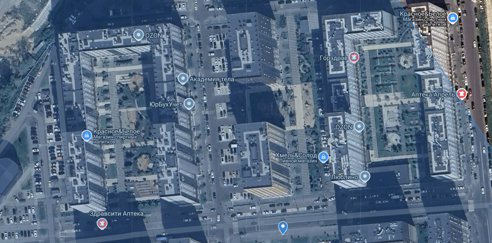

# Цель разметки

- Оценить ключевые характеристики городской среды в выбранных жилых комплексах (ЖК)

## Предоставляемые данные

1. Данные для разметки предоставляются в виде интерактивной карты. 

2. При нажатии на каждую из ячеек карты появляется возможность заполнить необходимые атрибуты 

## Правила разметки

При нажатии на ячейку открывается список следующих атрибутов. Вам требуется прожать галочки (Да/Нет) в тех атрибутах, которые вы видите на спутниковой карте или на панорамах:

1. **Тип застройки нового жилого комплекса** (взаимоисключающие - может быть отмечен только 1 тип):

>`периметральный компактный` \
Здания формируют закрытые дворы и расположены вдоль уличного фронта

>`микрорайонная` \
Здания расположены в хаотичном порядке, не формируют закрытых дворов, могут иметь разную форму. Здания "раскиданы" по территории.

>`строчная`\
Застройка параллельными рядами относительно длинных зданий,в общем случае расположенных под углом к улицам

>`смешанная` \
При смешанной застройке сочетаются периметральный и/или микрорайонный и/или строчный типы застройки

>`затрудняюсь ответить`\
Данный вариант для ситуаций, где вы не можете однозначно классифицировать тип застройки